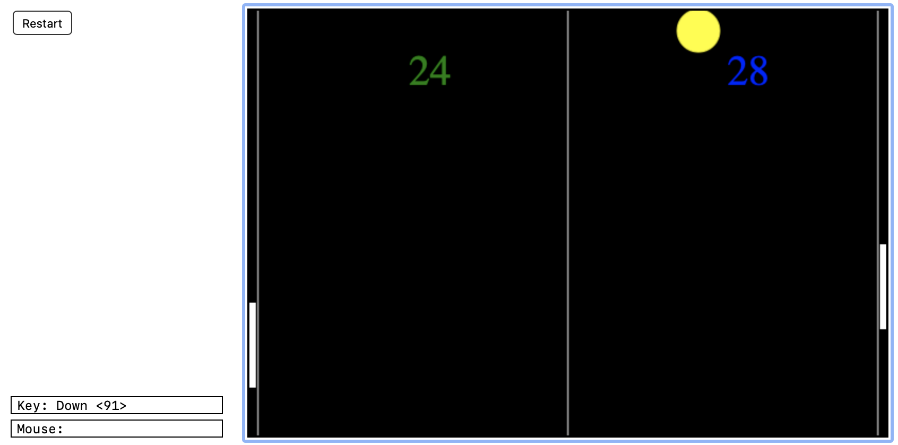
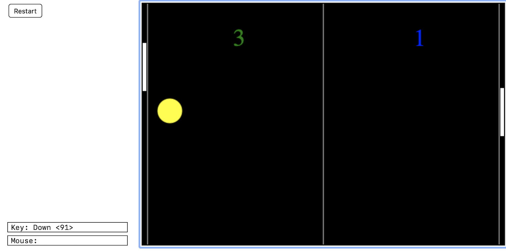
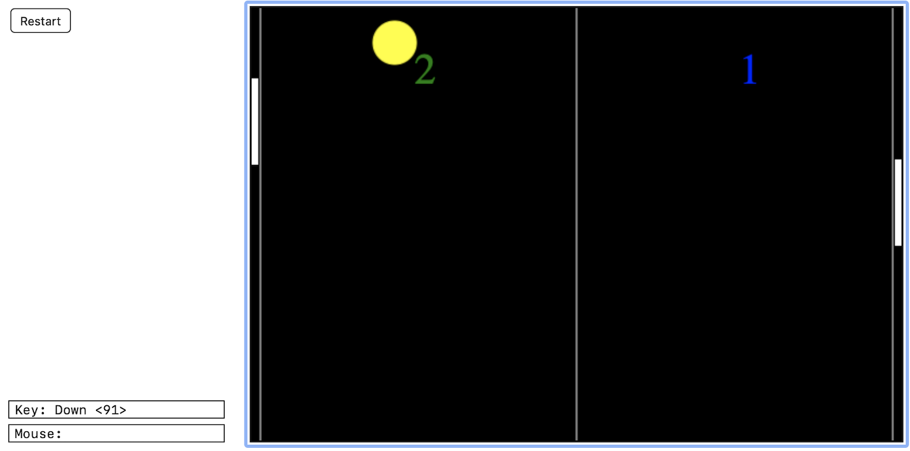
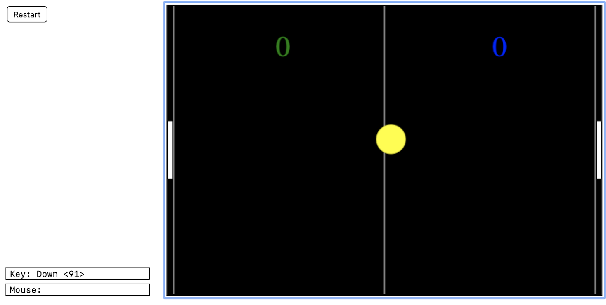

#  &nbsp; Pong -

This project was built using Python as a part of the minor specialization in [Fundamentals of Computing using Python offered by Rice University, Texas](https://www.coursera.org/specializations/computer-fundamentals). An online IDE, named [CodeSkulptor](https://py2.codeskulptor.org/) was used for building this project. It is an adaptation of the old game [Pong](https://en.wikipedia.org/wiki/Pong) where there are two small bars at the left and the right side of the game screen. A ball moves in the space and the two bars are used for preventing the ball from going outside the game screen using Up, Down, Left and Right arrow key (for controlling the right bar) and W, A, S, D keys (for controlling the left bar). You can find the implementation of the code [here](http://www.codeskulptor.org/#user47_NsnhfJPt4TmFbJX.py).

## Game Images -

 &nbsp;
 &nbsp;
 &nbsp;

Icons made by <a href="https://www.freepik.com" title="Freepik">Freepik</a> from <a href="https://www.flaticon.com/" title="Flaticon">www.flaticon.com</a>

